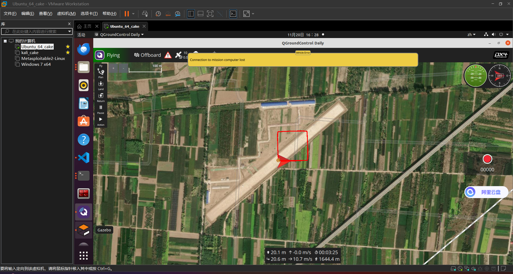
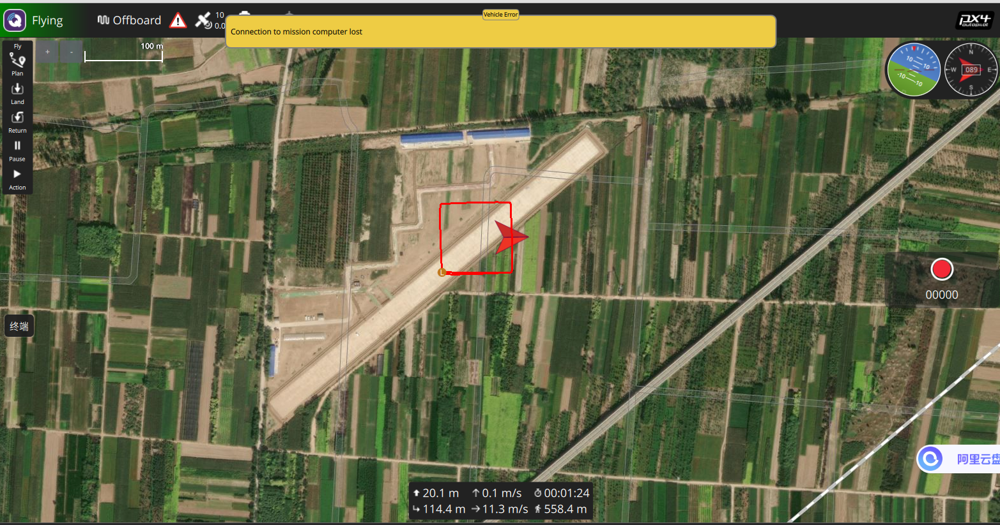

### 学习内容：

1.学习如何配置PX4环境。详细请见配置文档。

2.编写PX4应用程序，并且在仿真（`<code>`SITL `</code>`）中运行。

* 步骤1：编写简单自定义应用程序，打印 `<code>`Hello Sky!`</code>`。参考：https://docs.px4.io/main/zh/modules/hello_sky.html
* 步骤2：在PX4-Autopilot/boards/px4/sitl/default.px4board中启用应用程序
* 步骤3：在PX4-Autopilot/build/px4-sitl_defalut/px4_boardconfig.h中启用引用程序
* 步骤4：在PX4-Autopilot/下编译 `<code>`make px4_sitl_default `</code>`
* 步骤5：启动仿真环境： `<code>`make px4_sitl_default {gazebo/gazebo-classic}(选择自己启用的仿真软件)`</code>`

  * 在控制台输入 `<code>`help `</code>`时，能找到编写的自定义程序 `<code>`px4_simple_app `</code>`
    ``
  * 在控制台输入自定义程序名称，运行该程序会打印相关内容
    ``

### 本周任务：

1. 编写应用程序 `<code>`my_example_app `</code>`，实现如下功能:

   * 在控制台输入 `<code>`my_example_app time `</code>`时，控制台隔 1s打印程序启动的时间，效果如下：

     
   * 在控制台输入 `<code>`my_example_app count a b `</code>`时，计算并打印a+b的结果，效果如下

     
   * 注意：要在一个程序内完成所有功能
   * 提示：程序如何从控制台获得输入：考虑 <code>int my_example_app_main(int argc, char *argv[])</code>中的 <code>argc </code>和 <code>argv </code>
2. PX4仿真实现无人机飞四边形
   要求：在配置好的仿真环境中实现**四旋翼**无人机绕四个定点飞行，效果在QGC显示如下图所示：

   

   对于四个点的位置不做硬性要求，凭自己喜好设定，你甚至走出来的形状不是四边形。

   对无人机朝向在此次任务中不做要求，即以下情况是允许的（航线和飞机朝向不一致）：

   
   实现语言不限，方式不限，你可以编写python脚本、ros包、PX4自定义应用程序来实现这个任务，可以采用不同的PX4模式来实现(OFFBOARD，MISSION模式等等)。在报告中展示你的思路和学习到的知识。
   这里提供两个实现思路：
   有限状态机 + PX4的OFFBOARD模式 +MAVROS（推荐这个实现）
   PX4的MISSION模式 + MAVROS（在之后的过程中基本不会用到MISSION，不推荐）

   一些资料可供参考：

   [PX4+Offboard模式+代码控制无人机起飞（Gazebo）](https://blog.csdn.net/HuangChen666/article/details/128755418)

   [PX4 MISSION模式](https://mavlink.io/en/services/mission.html)

   [无人机实现航点飞行](https://blog.csdn.net/sinat_16643223/article/details/139201715)

   

   附加任务：

   （1）在任务2中我们没有对四旋翼朝向做要求，你可以思考如何使得四旋翼在按照预设航线飞行时保持四旋翼朝向正确（固定翼是不会面临这个问题的），提示：四元数和欧拉角。你可以给出理论，最好可以进行仿真实现。在报告中呈现你所做的。
   
   （2）尝试不同的方式实现任务2，也可以在任务2的基础上进行扩展，在实验报告中呈现出来。
3. 评分标准：

| 评分项                                                       | 积分值 |
| ------------------------------------------------------------ | ------ |
| 完整搭建PX4仿真环境                                          | 40     |
| 编写应用程序 <code>my_example_app </code>                    | 20     |
| 实现仿真四旋翼起飞（要求代码实现，控制台命令控制不计入分数） | 10     |
| 实现仿真四旋翼飞四边形                                       | 30     |
| 附加：解决仿真中四旋翼朝向问题，尝试不同方法实现任务2        | 20     |
|                                                              |        |
