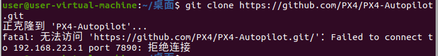
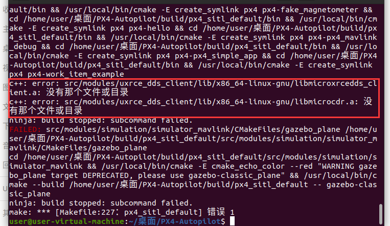

# 欢迎来到飞控指南！

在这里，你会了解到基本的有关PX4的相关知识。

前置环境和知识：能够正常运行的ubuntu环境，熟悉linux基本操作。推荐搭建PX4的vscode环境，[vscode环境配置看这里](https://docs.px4.io/main/zh/dev_setup/vscode.html) (考核中如果没有时间可以暂时用gedit凑合一下)

温馨提示：基于ubuntu 20.04+rosnoetic

* 下面出现的命令行有些不要直接复制粘贴，是要看自己的安装路径和其他信息做出修改。
* 遇到报错时，要查看清楚报错信息，尽量在网上查找报错原因和如何修正，从中学习关于ros和px4的一些知识
* px4的环境配置可能有点麻烦和困难，放平心态耐心坚持~~
* PX4官网：https://docs.px4.io/main/en/

[TOC]

## 一：PX4介绍：

PX4，通常指的是Pixhawk 4（简称PX4）飞控，这是一款在无人机领域广泛应用的飞行控制系统。Pixhawk系列飞控由知名的无人机开源硬件和软件提供商ArduPilot或APM（Ardupilot Mega）开发，而PX4作为其中的一员，集成了先进的传感器、处理器和通信技术，为无人机提供了稳定、可靠的飞行控制。

PX4飞控的核心特点包括：

1. **高性能处理器**：PX4通常搭载了高性能的处理器，如STM32F4系列或更高级的处理器，以确保飞行控制算法的实时性和准确性。
2. **集成传感器**：PX4集成了包括加速度计、陀螺仪、磁力计、气压计等在内的多种传感器，用于实时监测无人机的姿态、速度和高度等信息。
3. **MAVLink通信协议**：PX4支持MAVLink通信协议，这使得它能够与地面站、其他飞控系统或ROS（机器人操作系统）进行高效的数据交换和控制指令的发送。
4. **扩展性**：PX4飞控提供了丰富的接口和扩展槽，可以连接各种外部传感器、执行器或通信模块，以满足不同应用场景的需求。
5. **开源和可定制**：作为开源飞控系统的一部分，PX4的代码是公开的，用户可以根据自己的需求进行定制和修改。
6. **稳定性和可靠性**：Pixhawk系列飞控以其出色的稳定性和可靠性而闻名，PX4也不例外。它经过严格的测试和验证，能够在各种复杂环境中保持稳定的飞行控制。
7. **兼容性**：PX4飞控兼容多种无人机机架和动力系统，适用于从小型多旋翼到大型固定翼等多种类型的无人机。

## 二：PX4飞控源码的下载

[参考资料](https://docs.px4.io/main/zh/dev_setup/dev_env_linux_ubuntu.html)

源码编译PX4时会检查PX4是否是经过git拉取获得的，所以**必须经过git拉取获得PX4源码**，直接下载源码ZIP包再去编译会报错。

1. 首先在ubuntu中下载好git（在之前你可以先更新升级一下软件包）。输入以下命令（温馨提示：ubuntu输入密码时是不会显示的，所以盲打完回车就行）：

```
sudo apt-get install git
```

2. 在你想要放置PX4源码的路径下打开终端，输入以下命令来拉取PX4仓库：

```
git clone https://github.com/PX4/PX4-Autopilot.git 
```

* *由于网络原因，这一步非常非常玄学，可能一次成功，也可能要试亿次，比较折磨心态，有条件可以在ubuntu里面挂个代理。*



* **如果你受够了github的繁文缛节，那么，接下来的命令可以摆脱github带来的网络困扰。这个命令直接从国内网站gitee上拉取而不经过github，[参考连接](https://www.cnblogs.com/yunmeng-shi/p/16330819.html#:~:text=%E8%8B%A5%E8%AF%A5%E6%AD%A5%E9%AA%A4%E5%87%BA%E9%94%99%EF%BC%8C%E5%BD%92%E6%A0%B9%E5%88%B0)**：

```
git clone https://gitee.com/syre/PX4-Autopilot.git
```

* **如果这个网站万一失效了，也可以换成github的镜像网站和gitee上的其他PX4网站进行拉取。**

* *如果你执意要在github上拉取且由于网络问题多次失败，那么假如你的主机有代理，可以让你的虚拟机也用主机的代理，教程连接如下：*[虚拟机使用主机代理](https://blog.csdn.net/weixin_63594197/article/details/138069939)

* *如果拉取过程中出现报错如下，看下面的连接：*


[git报错：The TLS connection was non-properly terminated.](https://blog.csdn.net/qq_42921511/article/details/120551306)

*PS：上面连接中解决报错的第一种方法会导致只有root用户才有权限操作拉取的PX4-Autopilot文件夹，所以如果你使用第一种方法解决问题，那么你还需要通过如下命令添加普通用户的权限（其实是打开了该文件夹的所有权限）：*

```
sudo chmod 777 PX4-Autopilot
```

下载完成后，会在当前终端的路径下面看见一个PX4-Autopilot文件夹：


这就是PX4源码文件夹了。

然后运行以下命令：

```
bash ./PX4-Autopilot/Tools/setup/ubuntu.sh
```

这个命令会自动帮你配置编译所需环境，十分方便。

## 三：MAVROS配置

### 1. MAVROS相关介绍

* **MAVROS**

MAVROS，全称是“Micro Air Vehicle ROS”，是一个用于与MAVLink协议兼容的飞控进行通信的ROS（Robot Operating System，机器人操作系统）包。它主要起到无人机与ROS系统之间的桥梁作用，负责将ROS系统中的指令转换为飞控可以理解的信号，同时也将飞控的传感器数据和状态信息转换为ROS系统可以理解的格式。

* **MAVLink**

MAVLink是一种轻量级、二进制的消息传输协议，广泛应用于无人机和机器人系统中，用于系统与控制台或地面站之间的通信。它具有轻量级、可靠性、灵活性、标准化和跨平台等特点，使得不同设备间能够有效通信。MAVLink消息使用小于255字节的包，非常适合带宽有限的无线电链路，并且每条消息都有一个序列号，以帮助接收方检测丢失或重复的消息。

* **MAVROS与MAVLink**：MAVROS是一个ROS扩展包，它利用MAVLink协议与无人机飞控进行通信。MAVROS通过解析和封装MAVLink消息，实现了ROS系统与无人机飞控之间的数据交换和控制指令的发送。

* **MAVLink与PX4**：MAVLink是PX4飞控与地面站或ROS系统（通过MAVROS）进行通信的协议。PX4飞控使用MAVLink协议发送和接收数据，实现了与ROS系统或其他控制台的通信和控制。
* **MAVROS与PX4**：通过MAVLink协议，MAVROS能够与PX4飞控进行通信和控制。MAVROS将ROS系统中的指令转换为MAVLink消息发送给PX4飞控，同时也将PX4飞控发送的MAVLink消息转换为ROS系统可以理解的格式。

### 2. MAVROS安装

（此处采用二进制形式安装，ubuntu 20.04+rosnoetic）

```
sudo apt-get install ros-noetic-mavros ros-noetic-mavros-extras
```

```
wget https://raw.githubusercontent.com/mavlink/mavros/master/mavros/scripts/install_geographiclib_datasets.sh
```

```
chmod +x install_geographiclib_datasets.sh
sudo ./install_geographiclib_datasets.sh
//这一步可能比较慢，下载安装数据
```

需要在 .bashrc 中添加px4源码

```
gedit .bashrc
//打开 .bashrc
```

添加如下：(这个有点玄学，如果后续有相关报错，需要自行搜索，下面的路径要替换成自己PX4源码的路径)

```
source ~/PX4-Autopilot/Tools/simulation/gazebo-classic/setup_gazebo.bash ~/PX4-Autopilot ~/PX4-Autopilot/build/px4_sitl_default
export ROS_PACKAGE_PATH=$ROS_PACKAGE_PATH:~/PX4-Autopilot
export ROS_PACKAGE_PATH=$ROS_PACKAGE_PATH:~/PX4-Autopilot/Tools/simulation/gazebo-classic/sitl_gazebo-classic
export ROS_PACKAGE_PATH=$ROS_PACKAGE_PATH:~/PX4-Autopilot/Tools/sitl_gazebo
//注意export 开头的环境变量必须放在最下面
```

添加完保存后需要在命令行：

```
 source .bashrc
```

## 四：仿真初尝

### 1. 仿真软件和地面站介绍：

* 仿真软件一般可以用<code>gazebo</code>，<code>gazebo-classic</code>，这个在ros中是自带的，可以在终端输入gazebo或者gazebo-classic看是否存在
* QGC地面站，即QGroundControl，是一款开源的无人机地面站软件，专为无人机操作员设计。以下是对QGC地面站的详细介绍：

  1. **无人机控制**：QGC地面站提供了对无人机的全面控制功能，包括起飞、降落、悬停、飞行轨迹调整等。
  2. **实时监视**：通过实时数据传输，QGC地面站可以显示无人机的飞行状态、传感器数据、地图位置等信息，帮助操作员实时监控无人机的飞行情况。
  3. **校准功能**：QGC地面站支持对无人机的传感器、陀螺仪等关键部件进行校准，确保无人机在飞行过程中的稳定性和准确性。
  4. **设置功能**：操作员可以通过QGC地面站对无人机的各项参数进行设置，如飞行模式、飞行高度、速度等，以满足不同任务的需求。
  5. **任务规划**：QGC地面站提供了强大的任务规划功能，操作员可以在地图上绘制飞行轨迹，设置飞行任务，实现无人机的自主飞行和智能控制。
  6. **多平台支持**：QGC地面站支持多种操作系统，如Windows、macOS和Linux等，方便不同用户的使用。

### 2. QGC地面站安装：


### 3. 在Gazebo下尝试仿真

注意: 固定翼模型是gazebo_plane，四旋翼是gazebo，我们只需要四旋翼gazebo

* 在PX4-Autopilot文件夹下，输入以下命令来开启gazebo仿真，这里选用的是四旋翼模型：

```
make px4_sitl_default gazebo
```

* *初始编译会耗费比较长的时间。由于版本问题，编译过程中可能会出现意想不到的错误。目前已知在所有配置完备的情况下，v1.13.3正常编译没有问题，而v1.14版本可能会出现如下报错：*



   *这是因为生成的文件位置不对，找到PX4-Autopilot/build/你对应编译生成的文件夹/src/modules/uxrce_dds_client/lib，把那两个文件放入x86_64-linux-gnu即可。*


然后继续重新运行

```
make px4_sitl_default gazebo
```

*即可。*

* build文件夹是编译目标目录，只有经过至少一次编译才会生成此文件夹，内部存放的是源码经过编译生成的编译选项、中间文件、目标文件等。编译不同版本的固件会生成不同的文件夹。

​	比如px4_fmu-v2_default就是make px4_fmu-v2_default命令编译生成的，用于飞控板的。

​	px4_sitl_default就是make px4_sitl_default命令编译生成的，用于jMAVSim仿真或**gazebo**仿真。

​	编译完成后，会在PX4-Autopilot文件夹下面的build文件夹下生成对应的编译文件，点击进去之后可以看见生成的文件，由于是仿真	编译，因此在该文件夹下并没有任何可以供固件“刷”的.px4文件。


​	下图展示了正式编译后会生成的.px4文件。


* 在成功运行仿真命令后，会进入nuttx的shell界面中（简称nsh），同时出现gazebo仿真界面：


​    （如果想要看是否配置成功，可以在控制台输入commander takeoff，能看到gazebo中的无人机成功起飞）

### 4. 联合QGC仿真

* 此时打开**虚拟机上**的QGC（也可以提前打开），可以自动连接上QGC（一般来说，仿真开QGC是为了查看飞行的轨迹，以及参数设置还有舵机等的配置）：


* **飞机起始点的设置**

QGC的飞机起始地点一般是默认的，一般为了方便我们的设点需求，我们需要修改它的初始地点，通过以下命令来设置飞机的初始点：

```
export PX4_HOME_LAT=38.55812805
export PX4_HOME_LON=115.14054632
export PX4_HOME_ALT=0
make px4_sitl_default gazebo_plane
```

前三个命令来对飞机的经纬高进行设置，在设置完自己的经纬高后，运行仿真即可，不过这个只是在当前的shell中临时设置环境变量，当你重新打开另一个终端时就会失效，如果想要永久设置，可以用以下的两个方法（选其一即可）：

1. [参考连接](https://discuss.px4.io/t/drone-spawn-position-setup/31970/9)

找到 /your_px4_path/PX4-Autopilot/Tools/simulation/gazebo-classic/sitl_gazebo-classic/worlds。 这个文件夹存放着仿真用到的所有场景（world），当你不去指定时，默认运行empty.world，如果指定了仿真环境，则打开对应场景的文件。
   打开后，找到以下几行，如果没有，则添加：

```
   <spherical_coordinates>
         <latitude_deg>38.55812805</latitude_deg>
         <longitude_deg>115.14054632</longitude_deg>
         <altitude>0</altitude>
   </spherical_coordinates>
```

   

   其中的数据换成自己想要的坐标即可。
2.

我们只需要把PX4_HOME_LAT等环境变量永久保存即可。在任意终端输入：

```
gedit ~/.bashrc
```

然后在最后几行输入：

```
export PX4_HOME_LAT=38.55812805
export PX4_HOME_LON=115.14054632
export PX4_HOME_ALT=0
```

这个示意图片里面的PX4_HOME_LON是为了测试所以改成110了，不用在意。


然后刷新变量：

```
source ~/.bashrc
```

这样变量就会永久保存在任意一个打开的shell里面了。

如果你想修改坐标，那么在.bashrc中修改后都要source一下，之后的shell才会获取更新的值。

飞机朝向的修改

这里以四旋翼无人机为例：

启动四旋翼无人机：

```
make px4_sitl_default gazebo
```

然后找到gazebo界面，Models -> iris(不同的飞机模型这个名字不一样的)，这个下面包含了飞机模型的一些性质，找到第一个pose属性，找到yaw属性，双击修改即可，改完后就可以看见	QGC中的模型的朝向也会变化。


**这里注意，如果你直接改sdf文件中的pose属性是没有效果的，原因尚不清楚，如果有懂的可以提交报告时说明一下。**

3. 一般来说，我们还会习惯性打开MAVROS，不仅是代码运行时需要MAVROS通信，有时MAVROS上展示的信息也值得我们去分析。

最简单的打开MAVROS的方法如下：打开新终端输入

```
roslaunch mavros px4.launch fcu_url:="udp://:14540@127.0.0.1:14557"
```

这是启用的仿真的MAVROS，方法很多，能启动mavros就行。

MAVROS启动后界面如下：


在nsh界面，输入（在下面直接输入就行）：

```
commander takeoff
```

即可使飞机起飞，由于是固定翼，因此飞机进入盘旋状态。


恭喜你！此时你已经完成了基本的仿真配置。
