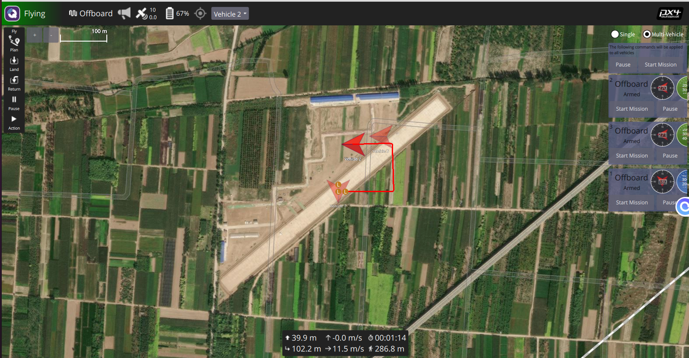

# 任务:

贡献者：@squarepantsbobsponge @cakerdsp

* 学习背景：了解roslauch（自行了解）和px4控制无人机运动的模式（在第二周task已经完成初步了解）

* 概述：完成仿真**多无人机飞行**，在仿真中启动多架无人机（使用roslaunch），并通过代码控制无人机飞行轨迹。

一个简单的示例如下：



* 要求：
  * 对飞行轨迹不做要求，自定义飞行轨迹
  * 要求一段代码控制多架无人机起飞

* 参考：

​	使用如下命令来启动多无人机：使用 ROS框架时执行了一个特定的启动文件<code>multi_uav_mavros_sitl.launch</code>（位于安装的PX4源    码中），用于配置和启动一个或多个无人机的仿真环境。

```
roslaunch px4 multi_uav_mavros_sitl.launch
```

​	但是一般初次运行会报错，一般是没有配置环境变量，可以参考下面的文章进行配置：

[参考文章](https://blog.csdn.net/f1ang_/article/details/129418234)

注意，PX4版本不同，sitl_gazebo和setup_gazebo.bash在源码中的路径会有变化，一般来说v13版本的是可以直接使用参考文章中的，v14及以后是如下命令：

```
source Tools/simulation/gazebo-classic/setup_gazebo.bash $(pwd) $(pwd)/build/px4_sitl_default
export ROS_PACKAGE_PATH=$ROS_PACKAGE_PATH:$(pwd):$(pwd)/Tools/simulation/gazebo-classic
```

代码可以写成死命令，不过最好写成一般性的代码，易于修改和维护。

* tips：要在px4中运行自己写的代码，首先需要创建一个ros功能包在功能包中编写自己的代码。在运行时，运行编译好的功能包和节点，还需要同时运行多个无人机的仿真环境


| 细则                                         | 得分 |
| -------------------------------------------- | ---- |
| 成功运行多个无人机仿真环境                   | 20   |
| 成功在gazebo中完成多台无人机起飞             | 20   |
| 控制多台无人机完成飞行轨迹                   | 40   |
| markdown文档说明步骤和遇到的问题以及个人理解 | 20   |

